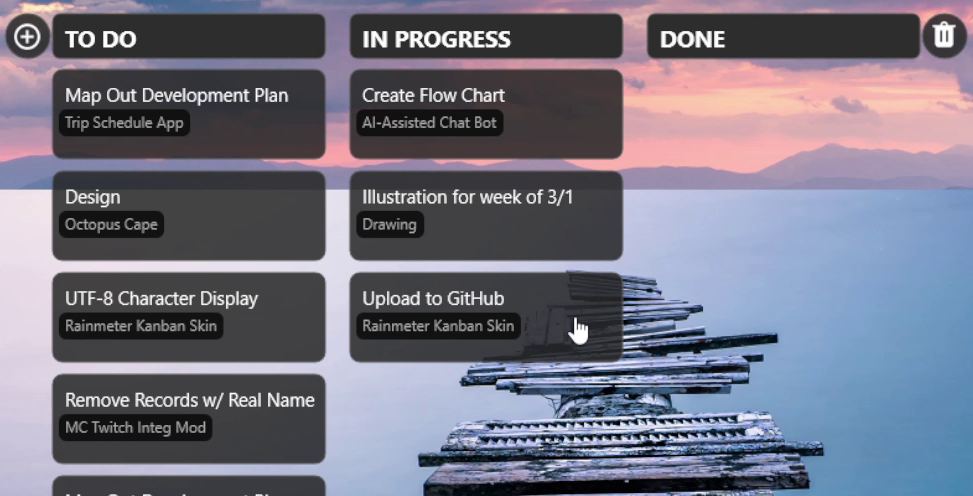

# Rainmeter Kanban Board

A lightweight **Kanban-style task board for Rainmeter** that lets you manage tasks directly on your desktop.

This skin provides a simple three-column workflow:

- **To Do**
- **In Progress**
- **Done**

Tasks can be moved between columns and managed directly from the Rainmeter interface.



---

# Features

- Desktop **Kanban board layout**
- **Three workflow columns**
  - To Do
  - In Progress
  - Done
- **Click to select / highlight tasks**
- **Move tasks between columns**
- **Add new tasks**
- **Clear all DONE items**
- Lightweight and responsive

---

# Requirements

- **Rainmeter 4.5+**
- Windows 10 / Windows 11

Rainmeter can be downloaded from:

https://www.rainmeter.net/

---

# Installation

### 1. Download the skin

Clone the repository:

```bash
git clone https://github.com/mikinoodles/Rainmeter_KanbanSkin.git
```

Or download the ZIP from GitHub.

---

### 2. Copy the skin

Move the folder into your Rainmeter skins directory:

```
Documents
└── Rainmeter
    └── Skins
        └── Rainmeter_KanbanSkin
```

---

### 3. Load the skin

1. Open **Rainmeter**
2. Go to **Manage**
3. Select **KanbanBoard**
4. Click **Load**

---

# Usage

## Selecting Tasks

Click a task to highlight it.

The selected task is visually emphasized for interaction.

---

## Moving Tasks

Selected tasks can be moved between columns.

Typical workflow:

```
To Do → In Progress → Done
```

---

## Adding Tasks

Use the **input UI** to add a task:

1. Enter a task summary
2. Optionally specify a project
3. Submit

The task will appear in the **To Do** column.

---

## Clearing Completed Tasks

A **trash button** next to the DONE column allows you to:

```
Delete all completed tasks
```

This helps keep the board clean.

---

# Project Structure

```
KanbanBoard Skin
│
├── Kanban.ini
│
├── @Resources
│   ├── Kanban.lua
|   ├── json.lua
│   ├── Images
|   |   ├── (image files)
│   └── Styles
│
└── README.md
```

---

# Technical Notes

The board is powered by a combination of:

- **Rainmeter meters**
- **Lua scripting**
- **Dynamic variables**

Lua manages:

- Task data
- Column organization
- Rendering logic
- Task interactions

Rainmeter handles:

- Visual layout
- User input
- Rendering updates

---

# Planned Improvements

Possible future additions:

- Drag & drop task movement
- Task editing
- Persistent task storage
- Task priorities
- Due dates
- Project filtering
- Scrollable columns
- Multiple boards

---

# Contributing

Contributions are welcome.

If you'd like to help improve the skin:

1. Fork the repository
2. Create a feature branch
3. Submit a Pull Request

---

# License

MIT License

---

# Acknowledgements

- Rainmeter community
- Lua scripting documentation
